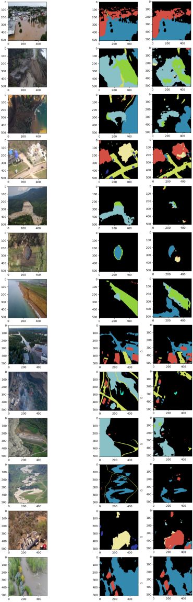

## Aerial Natural Disasters Unet
----
- Natural distaster images (taken from drones) semantic segmentation using U-Net.

- I was assigned to work on this project during my time as a summer intern at IPM.

----

## How to use?

#### Training:
`python train.py`

**arguements:**
* `--train_dir` - address to training and validation images directory.
* `--lr` / `-l` - Learning rate.
* `--base_lr` - Base learning rate.
* `--max_lr` - Maximum learning rate.
* `--lr_sched` - Learning rate schedular. Valid values: `reduce_on_plateau` and `cyclic` for CyclicLR.
* `--epochs` / `-e` - Number of training epochs.
* `--validation_split` / `-v`, - Validation split ratio during training.
* `--batch_size` / `-b`, - Batch size for training dataset.
* `--encoder` - Encoder's backbone architecture. Default is `resnet18`.
* `--debug` - Show debug info (logs and stuff).
* `--checkpoints_dir` - Checkpoints directory.
* `--loss_fn` - Loss function.
* `--save_best_only` - 
* `--resume_from_best` - 

#### Testing / Evaluating:
`python evaluate.py`

#### Predicting:
`python predict.py`

----
### Dataset
- Dataset was **from the LPCV2023 challenge <a href="https://lpcv.ai/2023LPCVC/program">Link</a>**.
- The dataset includes images of natural disasters taken from drone.
- Dataset was challenging, due to reasons including:
  - **Severe class imballance in the images**, which is a common thing for semantic segmentation tasks.
  - Very small (as images was taken from drones in high altitudes) and indistinguishable parts belonging to different classes.
- There are **13 classes**, which are:
background, avalanche, building_undamaged, building_damaged, cracks/fissure/subsidence, debris/mud//rock flow, fire/flare, flood/water/river/sea, ice_jam_flow, lava_flow, person, pyroclastic_flow, road/railway/bridge, vehicle

##### EDA:
Some of the images + their masks + classes distribution:

 

The picture above also shows the **classes proportions summed up in all of the images**. 
We can conclude that background class (black color in the masks), is the dominant class in almost all of the images.

- EDA codes are at `notebooks/eda.ipynb`.

----
### Model

##### Architecture:
- I chosen **CNN-based U-Net** as my main model's architecture for the task. Because it's very suitable for almost all of the segmentation tasks and it's already proven its strengths.
- I used the already implemented u-net models in pytorch from [Segmentation Models package](https://github.com/qubvel/segmentation_models.pytorch).

##### Training:
- Training codes are at `train.py` and `notebooks/train.ipynb`.
- Different loss functions `(focal, ce, dice, ce+dice)` can be used using the argument `--loss_fn`.
- Other training settings: `CyclicLR` schedular, `WANDB` for logging, `Adam` as optimizer.

##### Evaulation and Result:

- In the end using my model, I was able to achieve IOU of something about 0.3.
- Some of the predictions:

from left to right: Picture, GT mask, predicted mask.

* This shows that the model performs very well on some of the classes. But there's still room for improvement.

  
- In the end, unfortunately, because of lack of resources provided by IPM (GPU for exprimentation and training), I chosen to let this project go 😠.