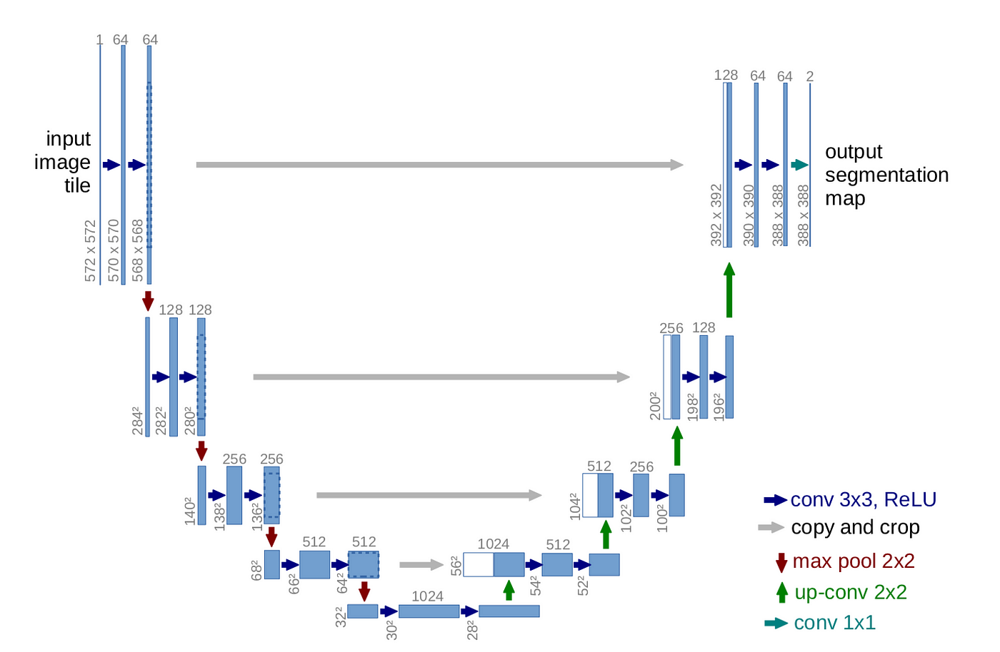
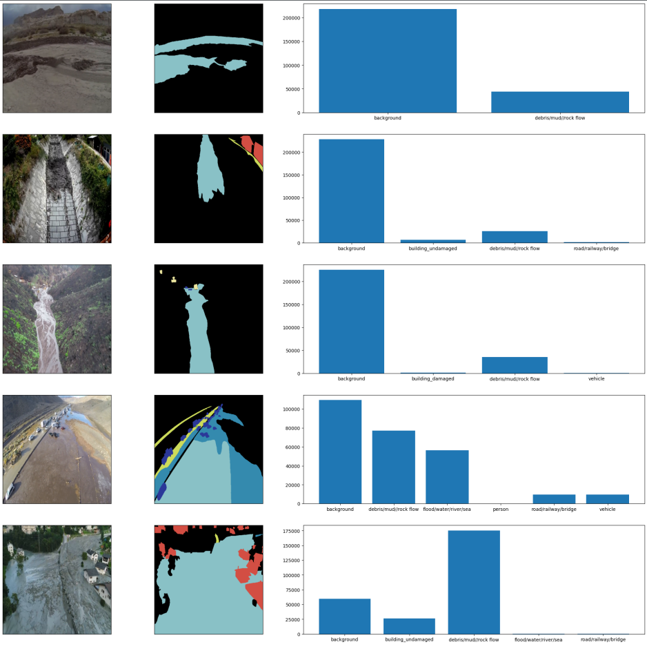
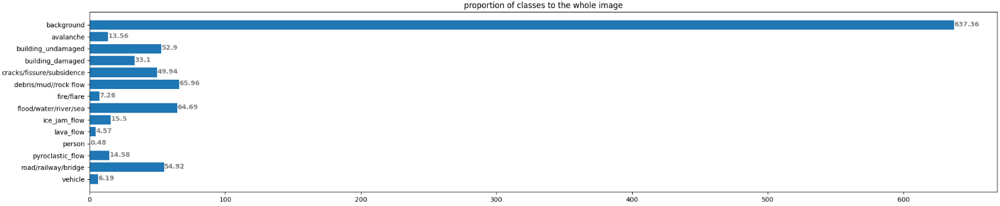

## Aerial Natural Disasters Unet
----
- Natural distaster images (taken from drones) semantic segmentation using U-Net.

- I was assigned to work on this project during my time as a summer intern at IPM.

----

### Dataset
- Dataset was **from the LPCV2023 challenge <a href="https://lpcv.ai/2023LPCVC/program">Link</a>**.
- The dataset includes images of natural disasters taken from drone.
- Dataset was challenging, due to reasons including:
  - **Severe class imballance in the images**, which is a common thing for semantic segmentation tasks.
  - Very small (as images was taken from drones in high altitudes) and indistinguishable parts belonging to different classes.
- There are **13 classes**, which are:
background, avalanche, building_undamaged, building_damaged, cracks/fissure/subsidence, debris/mud//rock flow, fire/flare, flood/water/river/sea, ice_jam_flow, lava_flow, person, pyroclastic_flow, road/railway/bridge, vehicle

##### EDA:
Some of the images + their masks + classes distribution:

 

The picture above also shows the **classes proportions summed up in all of the images**. 
We can conclude that background class (black color in the masks), is the dominant class in almost all of the images.

- EDA codes are at `notebooks/eda.ipynb`.

----
### My solution

##### Architecture:
- I chosen **CNN-based U-Net** as my main model's architecture for the task. Because it's very suitable for almost all of the segmentation tasks and it's proven its strengths.
- I mostly used already implemented u-net models in pytorch from [Segmentation Models package](https://github.com/qubvel/segmentation_models.pytorch).

##### Training:
- For training, I used Colab as the training platform, 
- Training code is at `train.py`.

[] using different losses
[] Dealing with class imballance:
[] using cyclic lr
[] using WANDB
[]

##### Evaulation and Result:

- In the end using my model, I was able to achieve IOU of something about 0.3.
[] add picutres
[] tell more

- Unfortunately, because of lack of resources provided by IPM (GPU for exprimentation and training), I chosen to let this project go 😢.